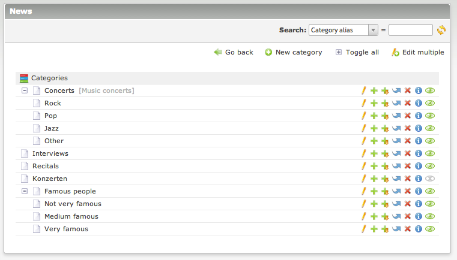

# News Categories extension for Contao Open Source CMS

News Categories is an extension for the [Contao Open Source CMS](https://contao.org).

Extend the Contao news module with categories. This extension adds a new header button in the news module. 
You can create categories there and then assign each news item to any of the categories, multiple selections are possible. 
In the front end make sure that your news list module is filterable by categories!

## Documentation

[Read the documentation](docs/README.md)

## Copyright

This project has been created and is maintained by [Codefog](https://codefog.pl).
