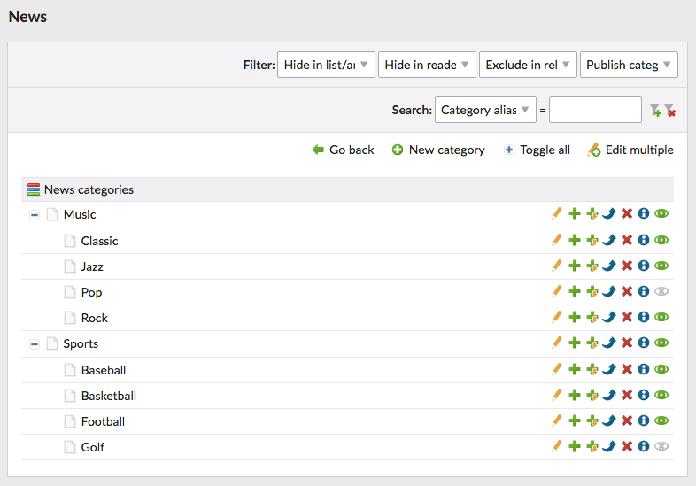

# News Categories Bundle for Contao CMS

News Categories is a Bundle for the [Contao CMS](https://contao.org).

Extend the Contao news module with categories which allows for better news organization in the frontend and backend.
Every category has its own title, alias, front end title, description and other useful features. Additionally, each 
of them can be hidden from the public just like the news articles. The extension comes with adjustments to all news 
frontend modules and an extra content element which allows for even quicker frontend stuff setup.

## Documentation

1. [Installation](docs/installation.md)
2. [Configuration](docs/configuration.md)
3. [Frontend modules](docs/frontend-modules.md)
4. [Template adjustments](docs/template-adjustments.md)
5. [News feeds](docs/news-feeds.md)
6. [Multilingual features](docs/multilingual-features.md)
7. [Insert tags](docs/insert-tags.md)

## Copyright

This project has been created and is maintained by [Codefog](https://codefog.pl).
