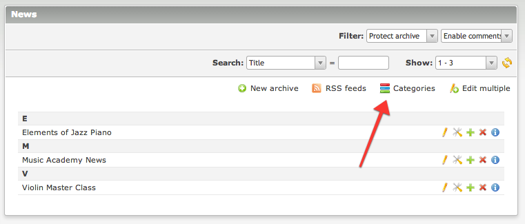
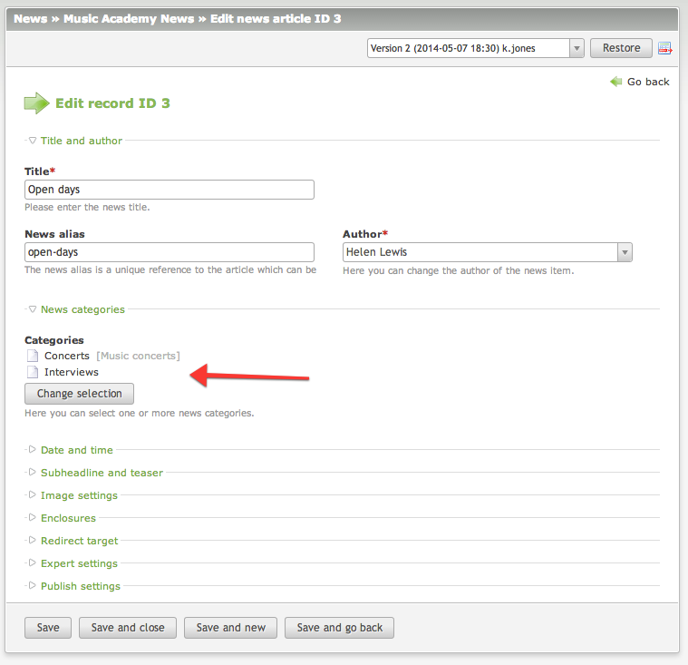
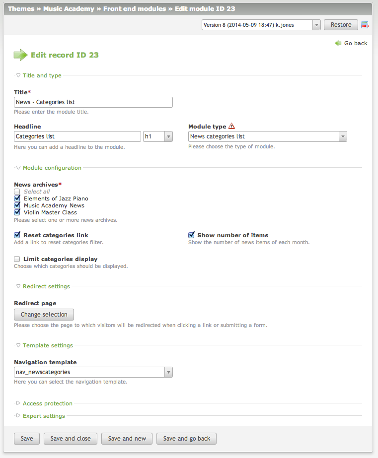
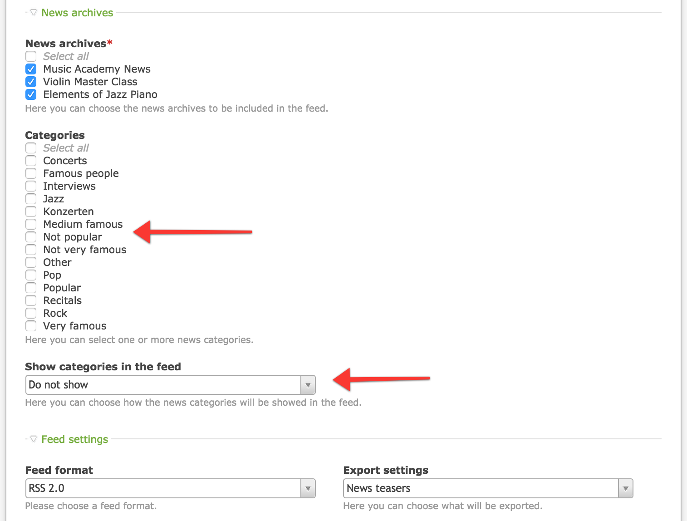
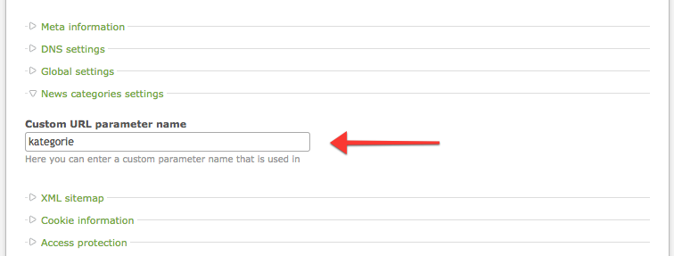

# News Categories – Documentation


## Managing categories

To edit news categories simply go to the `News` module and click the `Categories` button at the top of the page. 
You will see a sortable tree of categories. It is possible to create an unlimited number of subcategories on different 
levels.

Every category has its own alias which is a unique reference to the category in the front end. 
You can also optionally set the front end name. Additionally, each entry can be hidden from the public, just like news 
articles.



## Assign categories to news

Once you created some categories, it is time to assign them to news. You can do that by editing the news settings. 
Simply click the `Change selection` button and choose desired categories. Then confirm your choice by clicking the `Apply` 
button and finally save the news article.



## Front end modules

The extension comes with one front end module called News categories list. 
It will generate a list of categories as links that allows users to filter news items in other news front end modules.

**Make sure to check the `Filter by categories` option in the news front end module settings or the filtering won't work!**

Make sure to check the Filter by categories option in the news front end module settings or the filtering won't work!

Currently the following news modules are supported:

* Newslist
* News archive
* News archive menu



## Related categories list
The news list module has also a feature to display the related news items based on the categories of the current item. 
This is typically needed when you have a news reader module on the page and below you would like to display similar news. 
To achieve this, the module structure on the page has to be the following:

* news reader module
* news list module (related categories mode: yes)

## Filter content element

If you are managing a lot of categories and would like to display the different categories on different pages, 
you can have only one news list module and insert it using content element called `News module filtered`. 
The element allows you to override the module configuration with your custom one, so there is no longer need 
to create multiple list modules.

## Categories in news feeds

Each feed can be filtered by the categories. This feature can be configured in the feed settings. 
Additionally, you can display the categories of each article in the title or the teaser.




## Translate category URL parameter

If you have the website in other language than English or have multiple languages on your installation, 
you can set the custom category URL parameter per each website root.


Website root | Field value | Result URL 
--- | --- | ---
English | empty (default to "category") | /en/news/category/music.html
German | kategorie | /de/news/kategorie/music.html
Polish | kategoria | /pl/news/kategoria/music.html



## Display categories for news item

You can display the categories in your news_ template. Short hand version produces a comma-separated list of categories 
(e.g. `Categories: Foo, Bar, Foobar`):

```php
<p class="categories">Categories: <?php echo implode(', ', $this->categoriesList); ?></p>
```

Full version produces a list of categories:

```php
<?php if ($this->categories): ?>
<ul class="categories">
    <?php foreach ($this->categories as $category): ?>
        <?php if ($category['href']): ?>
        <li class="<?php echo $category['class']; ?>">
            <a href="<?php echo $category['href']; ?>" title="<?php echo $category['linkTitle']; ?>"><?php echo $category['name']; ?></a>
        </li>
        <?php else: ?>
        <li class="<?php echo $category['class']; ?>">
            <span><?php echo $category['name']; ?></span>
        </li>
        <?php endif; ?>
    <?php endforeach; ?>
</ul>
<?php endif; ?>
```

## Insert tags

As of version 2.7 it is possible to use the `{{news_categories::*}}` insert tags which will print information about 
the currently active category. Examples:

```
{{news_categories::title}} - prints category title
{{news_categories::frontendTitle}} - prints category frontend title
```

## Upgrade 1.x -> 2.x

The version 2.0.0 uses `nav_newscategories` template to display the categories navigation. 
If you have a custom `mod_newscategories` template, make sure to adjust it.