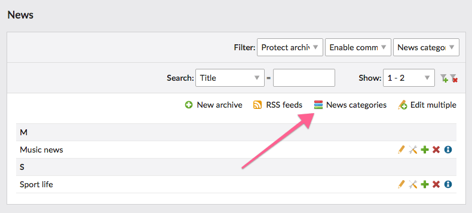
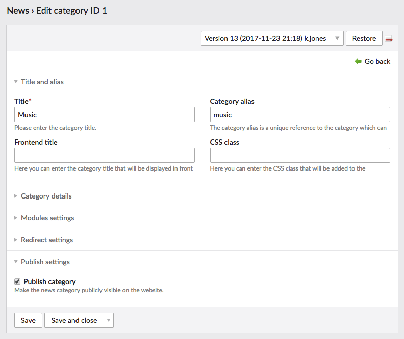
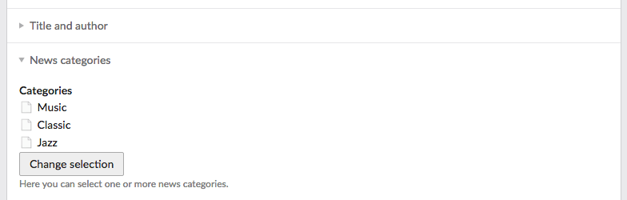
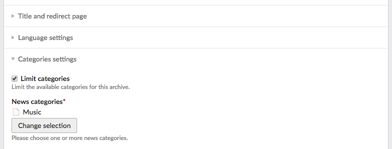

# Configuration – News Categories Bundle

1. [Installation](installation.md)
2. [**Configuration**](configuration.md)
3. [Frontend modules](frontend-modules.md)
4. [Template adjustments](template-adjustments.md)
5. [News feeds](news-feeds.md)
6. [Multilingual features](multilingual-features.md)
7. [Insert tags](insert-tags.md)

## Managing categories

To edit news categories simply go to the news module and click the categories button at the top of the page. 

You will see a sortable tree of categories. It is possible to create an unlimited number of subcategories on different 
levels.

Every category has its own alias which is a unique reference to the category in the front end. You can also optionally 
set the front end title, description and other useful details. Additionally, each entry can be hidden from the public 
just like the news articles.

## Assign categories 

Once you created some categories, it is time to assign them to news. You can do that by editing the news settings. 
Simply use the widget and choose desired categories. Then confirm your choice by clicking the and finally save the news 
article.

## Advanced configuration

### Limit categories per news archive

To narrow the categories selection individually per every news archive simply set it in the archive settings:

**Note:** this limitation also applies for the administrator users!
