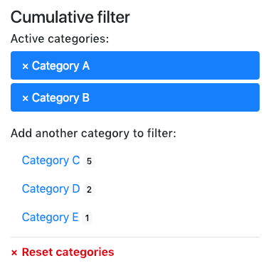

# Frontend modules – News Categories bundle

1. [Installation](installation.md)
2. [Configuration](configuration.md)
3. [**Frontend modules**](frontend-modules.md)
4. [Template adjustments](template-adjustments.md)
5. [News feeds](news-feeds.md)
6. [Multilingual features](multilingual-features.md)
7. [Insert tags](insert-tags.md)

## Frontend modules

### News categories list

The extension comes with an extra front end module that will generate a list of categories as links, which allows users to 
filter news items in other news front end modules.

### News categories cumulative filter

For a more advanced filtering similar to a tag cloud, you can use the news categories cumulative filter module.
It displays a flat list of the categories and allows to combine multiple filters. The categories are displayed 
as two lists: currently active categories and remaining categories that will still produce some results.  

> **Important:** Make sure to check the `Filter by categories (cumulative)` option in the news list/archive front end module settings 
> or the filtering won't work!  

By default, the cumulative filter uses an intersection (x AND y) to filter news entries. That means, if you select
categories A and B, then each news must belong to both categories the same time to be displayed.

In case you would like to display news belonging to either category, select the `Filter by categories using union (cumulative only)` 
option in both cumulative filter module and respective news listing module. It will change the filtering behavior to use
a union (x OR y) search instead of intersection.

### News modules

The bundle overwrites the default news modules by adding the extra category related features to them. They are fully
optional so your existing modules setup won't be affected until you change their configuration manually.

> **Important:** Make sure to check the `Filter by categories` option in the news front end module settings 
> or the filtering won't work!

Currently the following news modules are supported:

 - News archive
 - News archive menu
 - News list
 - News reader
 
### Related categories list

The news list module has also a feature to display the related news items based on the categories of the current item. 
This is typically needed when you have a news reader module on the page and below you would like to display similar 
news. To achieve this, the module structure on the page has to be the following:

 - news reader module
 - news list module (in related categories mode)

## Filter content element

If you are managing a lot of categories and would like to display the different categories on different pages, 
you can have only one news list module and insert it using content element called `News module filtered`. The element 
allows you to override the module configuration with your custom one, so there is no longer need to create multiple 
list modules.
